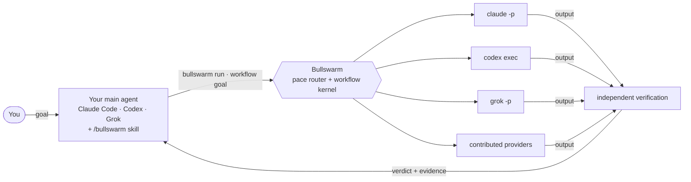
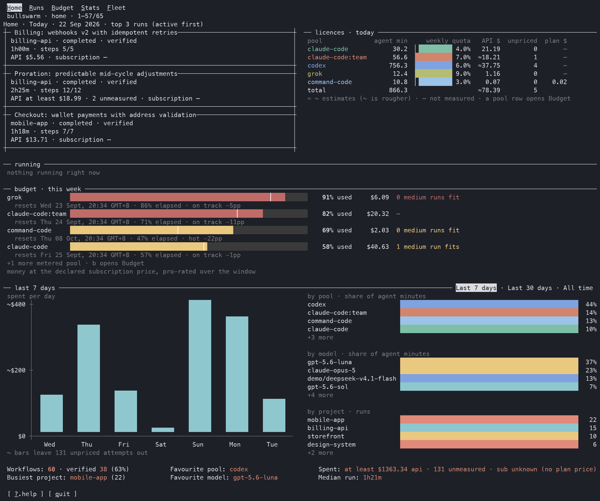
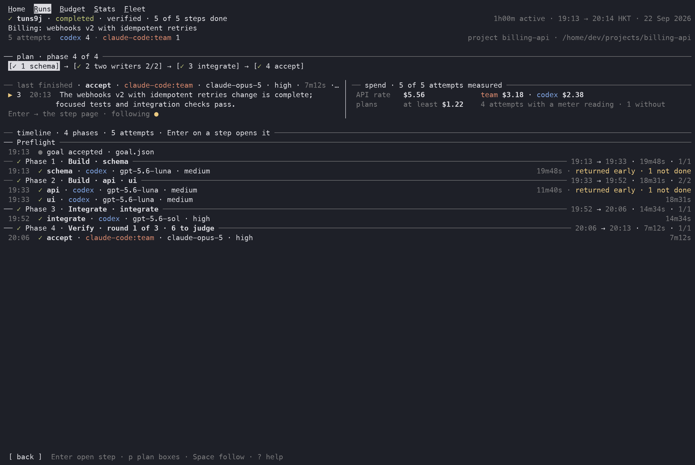

<p align="center">
  
</p>

<p align="center">
  <a href="https://www.npmjs.com/package/bullswarm"></a>
  <a href="LICENSE"></a>
  <a href="https://nodejs.org/"></a>
</p>

<p align="center">Route work across your coding-agent subscriptions, spend quota before it expires, and verify what comes back.</p>

## The problem

You pay for more than one coding agent: a Claude plan or two, Codex, Grok, maybe another.

Every one of them meters you on a clock — five-hour windows, weekly caps, monthly allowances — and unused quota is simply gone when the window resets.

So one plan runs dry mid-task while the others sit idle. You switch tools by hand just to spend what you already paid for. And the agent that wrote the code is usually the one that decides it is done.

## What Bullswarm does

Bullswarm turns the agent CLIs already signed in on your machine into **one fleet** that your main agent can command.



- **Spends quota by pace.** Each task goes to the plan with the most spare quota for how far its window has run, so a plan that is behind, or about to reset with quota left, gets used first.
- **Picks models for you.** Tasks come in three lanes (`analyze`, `build`, `chore`). Setup asks each CLI which models it offers and suggests the newest one for each effort level, so you don't have to update settings every time a vendor ships a model.
- **Runs one task or a whole workflow.** `bullswarm run` sends one task to one agent and returns a verdict. For bigger goals your main agent writes a plan; Bullswarm runs the independent steps in parallel across agents, then integration, and a review by a different agent when the plan asks for one.
- **Checks the work, not the exit code.** A delegate saying "done" isn't enough. Bullswarm reads what it actually produced, and a workflow finishing is kept separate from its requirements being verified.
- **Shows everything live.** A terminal dashboard covers quota, history, running workflows and each agent's individual turns.
- **Works with the agent you already use.** The `/bullswarm` skill teaches Claude Code, Codex and Grok when to delegate. There's also an early-access Claude Code Mod that shows runs and usage inside Claude Code.
- **Lets you steer mid-run.** Add, change, remove or rerun steps while a workflow is running, or pause and resume it.
- **Extends with providers.** Claude Code, Codex and Grok are built in. Other CLIs can be added as providers without touching the core.

## See it



*Home: what's running today, how much quota each plan has left, and what you've spent.*



*Run: one workflow's plan, which agent took each step, and what it cost.*

More screens, including phone-sized ones, are in the [gallery](https://bulls-work.github.io/bullswarm/guide/gallery).

## Why not just…

| Approach | What you give up |
|---|---|
| **One agent's built-in subagents or workflows** | Everything draws on that one plan's quota, the same vendor grades its own work, and your process is tied to that vendor's feature. |
| **An API gateway that re-exposes your subscriptions** | Turning a consumer subscription into a generic API endpoint can conflict with provider terms, and you lose each agent's own tools and harness. |
| **Switching tools by hand** | You become the scheduler, and the quota you did not get to still expires. |
| **Bullswarm** | Drives each vendor's own headless CLI—`claude -p`, `codex exec`, `grok -p`—the way those CLIs are meant to be scripted, with the accounts you already signed in. Work lands where quota is spare, and a different agent can check it. |

Bullswarm never proxies a subscription as an API and never collects or shares your vendor credentials.

The controller is portable. Claude Code, Codex, Grok, or any capable caller drives the same CLI and durable workflow kernel, so your workflows are not locked into one vendor's orchestration.

## Why now

Agent plans now come with hard weekly limits, and serious work spans hours rather than prompts. A workflow can run for one to two hours across several agents—builders in parallel, an integrator, then independent acceptance—while you keep handing new goals to your main agent.

With Bullswarm routing by pace, running several goals at once no longer means worrying about wasting one plan's scarce quota: the fleet spends whichever plan is furthest behind.

## Quick start

You need Node.js 22.12 or later and at least one agent CLI you're signed in to (Claude Code, Codex or Grok).

The easiest way to set up is to let your agent do it. Paste this into Claude Code, Codex or Grok:

```text
Install and set up Bullswarm for me:
1. Run `npm i -g bullswarm`.
2. Run `bullswarm setup --yes --strategy --integrate` to find my agent CLIs,
   pick models, and install the /bullswarm skill for each agent.
3. Run `bullswarm doctor` and tell me which agents are ready and how much
   quota each one has left.
4. Read the installed /bullswarm skill so you know when to use
   `bullswarm run` and when to write a workflow.
```

After that, just give your agent goals as usual. It will hand work to Bullswarm when that helps. Run `bullswarm` in a terminal to open the dashboard; closing it doesn't stop anything that's running.

To set things up by hand, or to choose models and reasoning yourself, see [Getting started](https://bulls-work.github.io/bullswarm/guide/getting-started).

## Supported agents and meters

| Agent CLI | Support | Quota windows tracked | Command it runs |
|---|---|---|---|
| Claude Code | Built in | weekly + 5-hour | `claude -p` |
| Codex | Built in | weekly | `codex exec` |
| Grok | Built in | weekly | `grok -p` |
| OpenCode | Contributed | none | `opencode run --auto` |
| Command Code | Contributed | weekly + monthly + 5-hour | `command-code -p` |

Each provider describes how to launch its CLI, read its quota, list its models and read its output. To add one, see [Adding a provider](https://bulls-work.github.io/bullswarm/reference/providers).

## Learn more

- [Documentation](https://bulls-work.github.io/bullswarm/)
- [Getting started](https://bulls-work.github.io/bullswarm/guide/getting-started)
- [Day-to-day playbook](https://bulls-work.github.io/bullswarm/guide/playbook)
- [How routing works](https://bulls-work.github.io/bullswarm/guide/routing)
- [Authoring workflows](https://bulls-work.github.io/bullswarm/guide/workflows)
- [The dashboard](https://bulls-work.github.io/bullswarm/guide/gallery) and [observing runs](https://bulls-work.github.io/bullswarm/guide/observing)
- [Provider reference](https://bulls-work.github.io/bullswarm/reference/providers)
- Contributing: [open an issue](https://github.com/Bulls-Work/bullswarm/issues) or [submit a pull request](https://github.com/Bulls-Work/bullswarm/pulls)
- [MIT licence](LICENSE)
