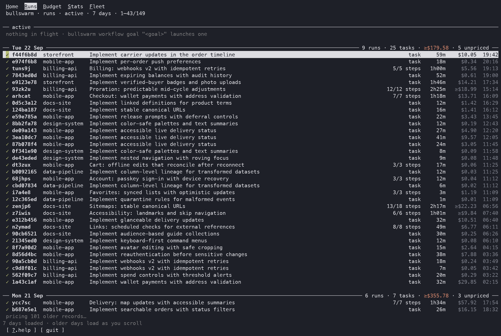
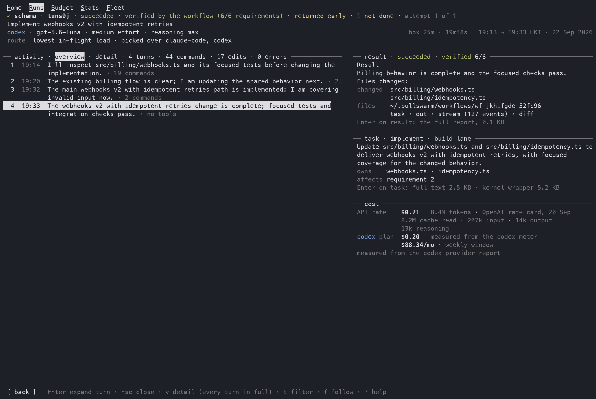
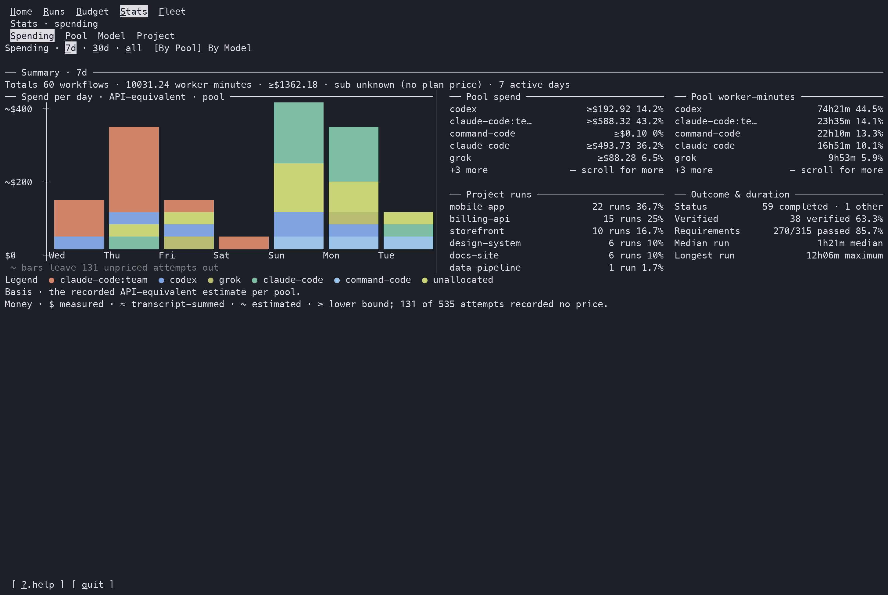
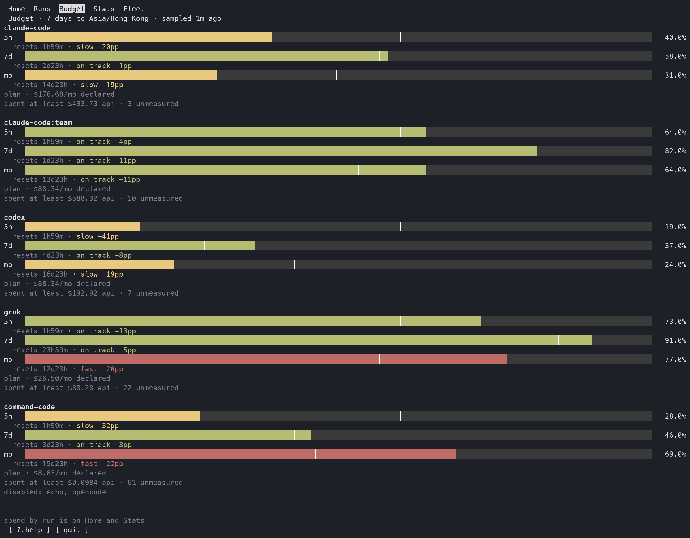
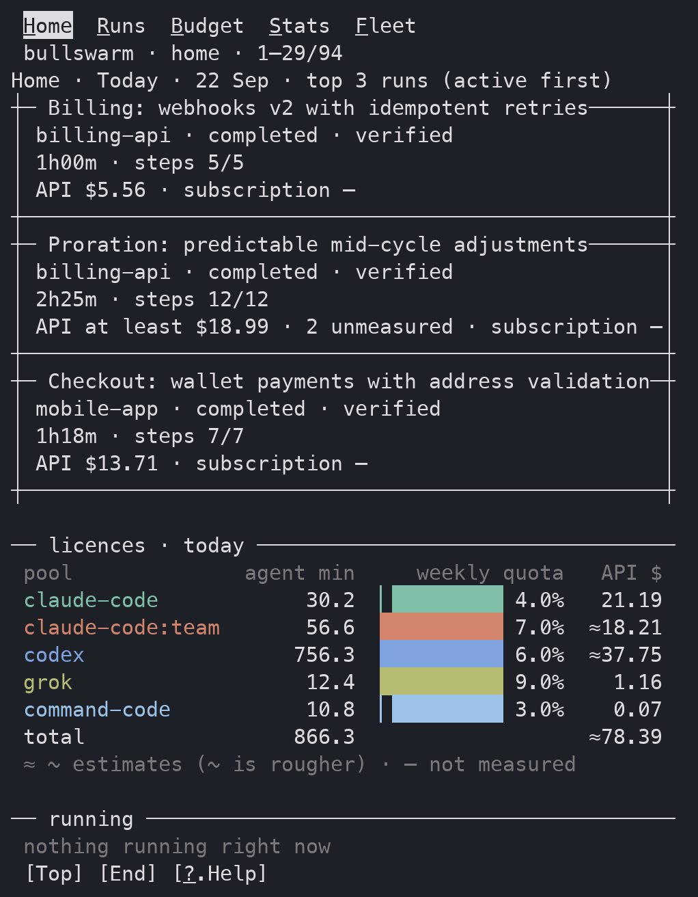
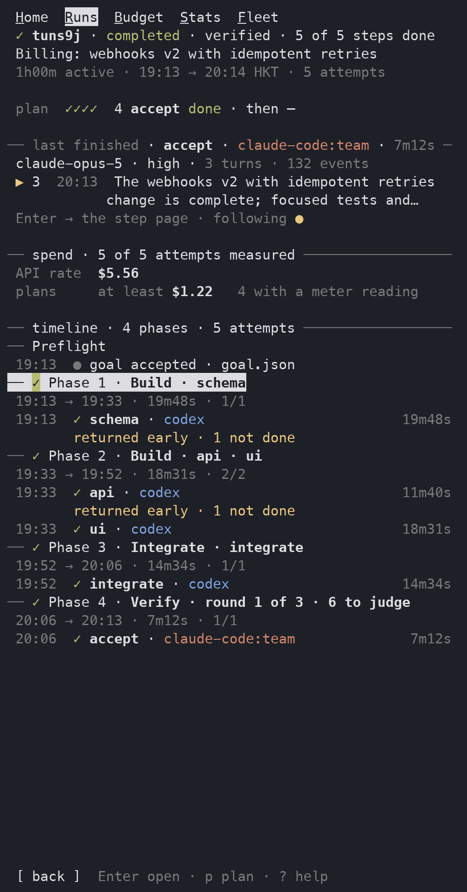

<p align="center">
  
</p>

<p align="center">
  
  
  
</p>

<p align="center">Route work across your coding-agent subscriptions, spend quota before it expires, and verify what comes back.</p>

## The problem

You pay for more than one coding agent: a Claude plan or two, Codex, Grok, maybe another.

Every one of them meters you on a clock — five-hour windows, weekly caps, monthly allowances — and unused quota is simply gone when the window resets.

So one plan runs dry mid-task while the others sit idle. You switch tools by hand just to spend what you already paid for. And the agent that wrote the code is usually the one that decides it is done.

## What Bullswarm does

Bullswarm turns the agent CLIs already signed in on your machine into **one fleet** that your main agent can command.


- **Paces quota instead of guessing.** Each task goes to the eligible pool with the most unused quota relative to its reset clock. A pool that is furthest behind pace—or close to resetting with quota left—moves forward.
- **Routes by the work.** The `analyze`, `build`, and `chore` lanes derive an effort tier; setup maps those tiers to provider and model choices, while `bullswarm setup --wizard` also configures reasoning depth. Or ask your agent to run the non-interactive setup.
- **Runs one bounded task.** `bullswarm run` routes it to one agent, waits, and returns a verdict.
- **Executes multi-phase workflows.** Your main agent authors a dependency graph; Bullswarm schedules ready, file-disjoint actions across agents in parallel, then runs integration and independent acceptance when the plan calls for them.
- **Verifies content, not exit codes.** A delegate's output is evidence. A zero exit code is never enough by itself, and workflow completion stays separate from verified requirements.
- **Shows the whole system live.** The terminal dashboard has Home, Runs, Run, Step, Budget, Stats, Fleet, and Help views, from portfolio-level quota and history down to individual agent turns.
- **Reads licence meters.** Built-in readers cover Claude Code, Codex, and Grok; the provider interface extends routing, meters, models, and event streams without putting vendor quirks in the core.
- **Lets your agent delegate.** The packaged `/bullswarm` skill teaches Claude Code, Codex, and Grok when to use a single run or a workflow.
- **Lives inside Claude Code too.** The early-access Claude Code Mod adds Bullswarm routing, a run strip, and read-only Run, Step, and Usage panes inside Claude Code.
- **Changes course while work is live.** Newer steering and plan-revision commands can add, amend, remove, or rerun actions; pause and resume remain explicit.

## Why not just…

| Approach | What you give up |
|---|---|
| **One agent's built-in subagents or workflows** | Everything draws on that one plan's quota, the same vendor grades its own work, and your process is tied to that vendor's feature. |
| **An API gateway that re-exposes your subscriptions** | Turning a consumer subscription into a generic API endpoint can conflict with provider terms, and you lose each agent's own tools and harness. |
| **Switching tools by hand** | You become the scheduler, and the quota you did not get to still expires. |
| **Bullswarm** | Drives each vendor's own headless CLI—`claude -p`, `codex exec`, `grok -p`—the way those CLIs are meant to be scripted, with the accounts you already signed in. Work lands where quota is spare, and a different agent checks it. |

Bullswarm never proxies a subscription as an API and never collects or shares your vendor credentials.

The controller is portable. Claude Code, Codex, Grok, or any capable caller drives the same CLI and durable workflow kernel, so your workflows are not locked into one vendor's orchestration.

## Why now

Agent plans now come with hard weekly limits, and serious work spans hours rather than prompts. A workflow can run for one to two hours across several agents—builders in parallel, an integrator, then independent acceptance—while you keep handing new goals to your main agent.

With Bullswarm routing by pace, running several goals at once no longer means worrying about wasting one plan's scarce quota: the fleet spends whichever plan is furthest behind.

## See it


*Home — today's work, budget position, trends, and recent runs in one view.*

| Runs | Run |
|---|---|
| [](docs/public/screens/runs.png) | [](docs/public/screens/run.png) |
| Active and historical workflows and single tasks in one table. | Phases, live workers, costs, and the attempt timeline. |

| Step | Stats |
|---|---|
| [](docs/public/screens/step.png) | [](docs/public/screens/stats.png) |
| The live or saved agent transcript, result, task, and cost evidence. | Workflow, spend, worker-time, and verification trends. |

[](docs/public/screens/budget.png)

*Budget — spend spare quota before each weekly or monthly window resets.*

<p align="center">
  
  
</p>

*Home and Run retain their core evidence at a 55-column phone width.*

## Quick start

Requires Node.js 22.12 or later.

```bash
npm i -g bullswarm
bullswarm setup
```

`setup` discovers installed agent CLIs, shows their quota state, and opens the provider/model control centre. An agent or CI process can use discovered defaults without prompts:

```bash
bullswarm setup --yes --strategy --integrate
bullswarm doctor
```

Run one bounded task:

```bash
bullswarm run --lane analyze --add-dir . \
  --prompt "List every TODO in src with file and line number." --json
```

Start a first workflow with an explicitly delegated planner:

```bash
bullswarm workflow goal \
  "Audit this repository and write a one-page summary" \
  --cwd . --orchestrator auto --watch
```

For normal use, your main agent should author `plan.json`, validate it, and launch the exact same goal:

```bash
bullswarm workflow plan contract \
  "1. Fix the parser. 2. Add independent verification." --cwd . --json

bullswarm workflow plan validate \
  "1. Fix the parser. 2. Add independent verification." \
  --cwd . --program plan.json --json

bullswarm workflow goal \
  "1. Fix the parser. 2. Add independent verification." \
  --cwd . --program plan.json --watch
```

Open the dashboard at any time. Quitting it does not stop running workflows.

```bash
bullswarm
# explicit form:
bullswarm workflow tui
```

## A practical playbook

1. **Nail down the outcome.** State what must change, what must remain untouched, and what evidence will count as done.
2. **Hand it to your main agent.** With the `/bullswarm` skill installed, it chooses a bounded run or authors a workflow program with clear territories, dependencies, integration, and acceptance.
3. **Let the graph fan out.** Ready, file-disjoint actions can run across Codex, Grok, Claude accounts, and contributed providers while routing spends the quota furthest behind pace.
4. **Stay in control.** Follow the dashboard or `workflow watch`; send guidance, pause, or revise the live plan when the goal changes.
5. **Sign off on evidence.** Read the durable result envelope and requirement evidence. `completed` and `verified` answer different questions.

You can keep several independent goals running without manually balancing every plan. Bullswarm accounts for in-flight load, while each workflow keeps its own durable state, outputs, events, and result.

## Supported agents and meters

| Agent CLI | Provider status | Subscription meter declared by the shipped connector | Headless entry point |
|---|---|---|---|
| Claude Code | Built in | weekly + 5-hour | `claude -p` |
| Codex | Built in | weekly | `codex exec` |
| Grok | Built in | weekly | `grok -p` |
| OpenCode | Contributed | none in the base connector | `opencode run --auto` |
| Command Code | Contributed | weekly + monthly + 5-hour | `command-code -p` |

Providers declare their own spawn command, meter reader, model discovery, reasoning levels, event decoding, and capabilities. See [Adding a provider](https://bulls-work.github.io/bullswarm/reference/providers).

## Status

Bullswarm is used daily. The maintainer's local records contained **335 workflow runs** and **507 single tasks** as of September 2026.

The routing, content verification, durable workflow kernel, dashboard, and built-in providers are established parts of the project. Mid-run steering and whole-plan revision are newer; use their validation and revision guards, and inspect the resulting evidence.

## Learn more

- [Documentation](https://bulls-work.github.io/bullswarm/)
- [Getting started](https://bulls-work.github.io/bullswarm/guide/getting-started)
- [How routing works](https://bulls-work.github.io/bullswarm/guide/routing)
- [Authoring workflows](https://bulls-work.github.io/bullswarm/guide/workflows)
- [Observing runs and the dashboard](https://bulls-work.github.io/bullswarm/guide/observing)
- [Provider reference](https://bulls-work.github.io/bullswarm/reference/providers)
- Contributing: [open an issue](https://github.com/Bulls-Work/bullswarm/issues) or [submit a pull request](https://github.com/Bulls-Work/bullswarm/pulls)
- [MIT licence](LICENSE)
